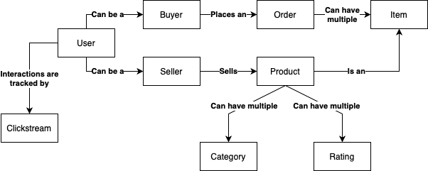
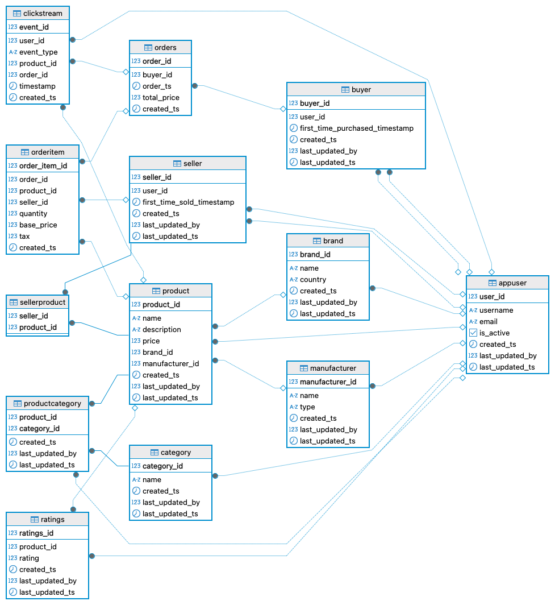
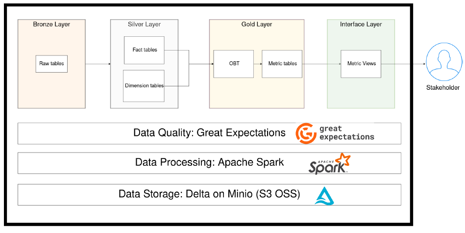

# Spark-Data-Engineering

This repository showcases a complete **end-to-end data pipeline** for an e-commerce dataset, designed following industry-standard best practices in data engineering and analytics. The project leverages **Apache Spark** for distributed data processing, adopts the **Medallion Architecture** for data lake structuring, implements a **One Big Table (OBT)** approach for analytics, and ensures robust testing with **PyTest** and **Great Expectations**.


 


## Table of Contents
1. [Project Deliverable](#project-deliverable)
2. [Infrastructure Overview](#infrastructure-overview)
3. [Data](#data)
    - [Conceptual Model](#conceptual-model)
    - [Entity-Relationship Diagram](#entity-relationship-diagram)
4. [Pipeline Design](#pipeline-design)
    - [Data Modeling](#data-modeling)
5. [Code Organization](#code-organization)
6. [Testing](#testing)
    - [Data Quality](#data-quality-testing)
    - [Code Logic](#code-logic-testing)
7. [Run Locally](#run-the-project-locally)

## Project Deliverable
The primary deliverable for this project is to design and implement a robust, industry-standard data pipeline for an e-commerce company. This pipeline will:
1.	**Generate Two Reports**:
    - Category Report: Displays the average and median revenue for every day and product category.
    - Order Report: Provides the total and average revenue for every day.
2.	**Enable Daily Data Load Frequency**: The pipeline will process and update data once per day to ensure stakeholders have access to the latest insights.
3.	**Incorporate Data Quality Checks**:
    - Ensure no duplicate records exist in key tables (e.g., orders, items, and clickstream events).
    - Validate that the average revenue in both reports does not exceed 100,000 USD, maintaining data reliability.

## Infrastructure Overview
The project infrastructure is composed of three primary services working together:

1. **Postgres database**: The project utilizes a PostgreSQL database to simulate an upstream application database.

2. **Spark Cluster**: A Spark cluster is deployed as the core of the project’s data processing infrastructure. It consists of a master node and two worker nodes, enabling distributed data processing at scale. Additionally, the cluster includes a history server, providing access to the Spark UI for monitoring logs, resource utilization, and the status of completed or failed Spark applications.

3. **Minio**: MinIO is implemented as a local storage solution, offering full API compatibility with AWS S3. This setup replicates S3 functionality locally.


## Data
The data used in this project is synthetic, generated to replicate the operations of an e-commerce company. The implementation and details of the data generation process can be found at [here](datagen/).


### Conceptual Model
To understand the data effectively, it is crucial to grasp the underlying business processes and how they drive interactions between various entities. This typically involves exploring the application or collaborating with business users and application experts to gain insights. The goal is to create a conceptual data model that provides a high-level overview of how different entities within the business interact, making it accessible and intuitive for non-technical stakeholders.




### Entity-Relationship Diagram
While the conceptual data model (CDM) provides a high-level view of how the business operates and how its entities interact, the Entity-Relationship Diagram (ERD) dives deeper into the specific data model used upstream. The ERD outlines the tables, their attributes, and the relationships between them, forming the backbone of the database structure.



## Pipeline Design
The project uses a medallion architecture to structure the data pipeline, consisting of bronze, silver, gold, and interface layers:
1.	**Bronze Layer:**
    - Pulls raw data from upstream sources, performs initial cleaning, and stores it.
    - Focuses on raw and cleaned raw data storage.
2.	**Silver Layer:**
    - Models the cleaned data into fact and dimension tables.
    - Prepares structured data for analytical purposes.
3.	**Gold Layer:**
    - Joins and aggregates fact and dimension tables to create OBTs and metric tables.
    - Focuses on generating analytics-ready tables with key metrics.
4.	**Interface Layer:**
    - Creates views on top of metric tables from the gold layer for stakeholders to query directly.



### Data Modeling
#### Fact Tables
1.	**fact_orders**: Order-level data, one row per order.
2.	**fact_order_items**: Item-level data, one row per item linked to orders via orderkey.
3.	**fact_clickstream**: Click interaction data (view, impression, checkout), linked to orders via orderkey.

#### Dimension Tables
1.	**dim_buyer**: Buyer information, created by joining buyer and user tables.
2.	**dim_seller**: Seller information, created by joining seller and user tables.
3.	**dim_category**: Category information.
4.	**dim_product**: Product information with metrics.

#### Bridge Tables
1.	**product_x_category**: Maps products to multiple categories.
2.	**seller_x_product**: Maps sellers to multiple products

## Code Organization
The project implements a reusable code template based on Object-Oriented Programming (OOP) design principles. This approach ensures modularity, consistency, and ease of maintenance across the ETL pipeline. Each table adheres to a standard ETL workflow encapsulated in five key steps:

1. **Extract**: Retrieves data from upstream sources. Any required input data for creating a table is treated as upstream, while tables depending on this table are considered downstream.
2. **Transform**: Applies transformations to the extracted data to create the desired table format.
3. **Validate**: Ensures that the transformed data adheres to predefined data quality checks for the table.
4. **Write**: Writes the validated data into a data store, making it available for downstream processes and consumption.
5. **Read**: Reads the data from the table, ensuring consistent naming conventions, formats, and explicitly defined columns for easier debugging.

To achieve reusability and maintainability, the project uses a [base class (template)](etl/utils/base_table.py) that defines these common ETL steps. Each table inherits from this base class and implements its unique logic for extraction, transformation, and validation, while reusing the common load and read functionalities.

### Metadata-Driven Pipeline
A **metadata-driven pipeline** leverages structured metadata to automate and streamline the ETL process. Instead of hardcoding configurations and logic for each step of the pipeline, metadata is used to define key aspects of the data and its transformations. This approach enhances scalability, reduces code duplication, and simplifies pipeline management.The project uses a dataclass called **ETLDataSet** to encapsulate metadata.

#### Key Components of a Metadata-Driven Pipeline
1.	**Where the Data is Stored**: Metadata specifies the storage location of the data using variables such as **storage_path**. This ensures that the pipeline knows exactly where to extract or load the data.
2.	**What the Data Is**: Metadata captures essential information about the data, such as the database name, table name, and the associated dataframe. These details allow the pipeline to operate contextually on the correct data.
3.	**How the Data is Stored**: The format and organization of the data are defined using variables like **data_format** (e.g., CSV, Parquet) and **partition_keys**. These attributes enable efficient storage and retrieval, particularly for large dataset

## Testing
To ensure the reliability and integrity of the data and code in the project, two types of testing are implemented: **data quality testing** and **code logic testing**.

### Data Quality Testing
To prevent stakeholders from accidentally consuming poor-quality data, data quality checks are conducted before making data available for consumption. While data quality is a broad and complex topic, the goal of this project was to explore and learn how to use the **Great Expectations** library and integrate it into a larger ETL pipeline.

As part of this exploration, two specific checks were implemented:
1. Ensuring no duplicate orders, items, or clickstream events exist in the gold-wide tables.
2. Verifying that the average revenue in both the daily and category-daily reports does not exceed 100,000 USD.

### Code Logic Testing

To validate the correctness of the project’s codebase, unit testing, integration testing, and end-to-end testing are implemented using the **PyTest** framework.
- **Unit Testing**: Validates the smallest units of code, such as individual functions or methods, to ensure they perform as expected.
- **Integration Testing**: Verifies that different modules or services within the system work together seamlessly.
- **End-to-End Testing**: Ensures the entire data pipeline operates as intended from input to output, covering all critical workflows.

## Run the Project Locally
> Ensure you have Docker, Make etc. installed on your system before starting. These dependencies are not included in the instructions below.

To run the project locally, follow these steps:
1. Clone the Repository
    ```bash
    git clone https://github.com/GregoryTomy/Spark-Data-Engineering
    cd Spark-Data-Engineering
    ```
2. Spin up the Infrastructure
    ```bash
    make up
    ```
3. Generate Data and Create Buckets in MinIO
    ```bash
    make setup
    ```
4. Run the Project End-to-End
    ```bash
    make project
    ```

For other available commands, refer to the [Makefile](Makefile).

---

This project was devloped as part of the excellent cource by [Joseph Machado](https://www.startdataengineering.com).
